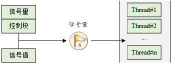
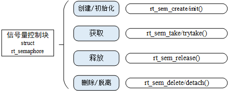
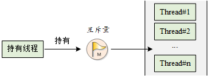
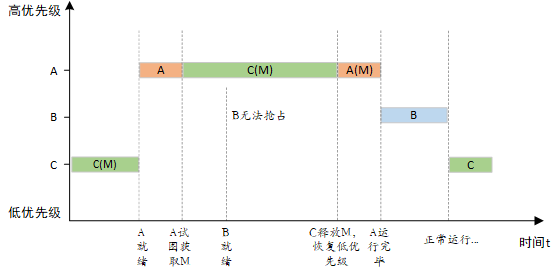

z在开始之前我们先讨论一下为什么rt-thread中很多对象跟接口都分成了静态跟动态两套

RT-Thread 中将很多对象和接口设计成静态和动态两种形式，主要是为了在**灵活性和确定性**之间取得平衡，以适应不同应用场景的需求。

### 1. 静态对象的优势：确定性与效率

静态对象在编译时就确定了内存分配，通常存储在全局或静态数据区。这种设计带来了以下优势：

- **无运行时开销**：静态对象的创建和初始化不涉及动态内存分配（`malloc`），因此没有堆操作的开销，这对于对实时性要求极高的任务非常重要。
- **无内存碎片**：由于不使用动态堆内存，可以从根本上避免内存碎片问题。在长期运行且频繁创建/销毁对象的系统中，内存碎片可能导致后续的动态内存分配失败。
- **更高的确定性**：内存地址在编译时就已固定，不会在运行时发生变化。这使得系统行为更可预测，特别是在资源受限或需要硬实时保证的系统中。
- **无需销毁**：静态对象的生命周期与程序相同，通常不需要显式地调用销毁函数，简化了资源管理。

**适用场景**：适用于那些数量固定、生命周期贯穿整个程序运行周期的对象，例如：

- **系统核心线程**：如空闲线程、定时器线程等。
- **固定数量的设备对象**：如串口、I2C 总线等。
- **全局的信号量或互斥量**：用于保护全局共享资源。

### 2. 动态对象的优势：灵活性与可扩展性

动态对象在程序运行时根据需要从堆内存中分配。这种设计带来了以下优势：

- **高度灵活**：可以根据程序运行时的情况动态地创建和销毁对象。例如，可以根据网络连接的数量动态创建线程或定时器。
- **更好的可扩展性**：系统的对象数量不再受编译时的限制。当需要处理更多任务时，可以随时创建更多线程、信号量或消息队列。
- **高效利用内存**：动态对象在不再需要时可以释放内存，将其归还给系统堆，供其他对象使用。这避免了静态对象长期占用内存造成的浪费。

**适用场景**：适用于那些数量和生命周期不确定、与特定任务绑定的对象，例如：

- **网络连接处理线程**：为每个新连接创建一个线程。
- **临时的定时器**：在某个任务中创建，超时后自动销毁。
- **动态创建的消息队列**：用于两个临时线程间的通信。

### 总结

静态和动态两种设计方式是RT-Thread为了在不同场景下优化系统性能和资源利用率而做出的选择。

- **静态方式**提供了**确定性、高效和无碎片**的优势，是嵌入式系统特别是硬实时系统的首选。
- **动态方式**提供了**灵活性和可扩展性**，使得系统能够适应复杂且多变的应用场景。

开发者可以根据具体需求，在两种模式中灵活选择，从而更好地平衡系统的性能、稳定性和资源利用。

***

信号量跟互斥量是为了解决竞态条件而出现的方法。

> 关于竞态条件，ai给了我们这样的回答

竞态条件（Race Condition）是多线程或多进程并发编程中的一个核心概念，指的是**当多个线程或进程并发访问和修改同一个共享资源时，最终的结果取决于这些线程的执行顺序，而这个顺序是不可预测的**。

简单来说，就是“谁先谁后”不确定，导致最后的结果也不确定。

### 竞态条件的产生

竞态条件通常发生在以下场景：

1. **共享资源**：多个线程同时访问同一个内存地址、变量、文件、数据库记录等。

2. **非原子性操作**：对共享资源的操作不是一个单一、不可中断的步骤。例如，`i++` 这个简单的操作实际上分为三个步骤：

   - 读取 `i` 的值。
   - 将 `i` 加 1。
   - 将结果写回 `i`。

   如果两个线程同时执行 `i++`，它们可能会在上述三个步骤中的任何一个地方被打断，导致最终结果错误。

***

### 信号量（Semaphore）

信号量本质上是一个**计数器**。它允许多个线程在同一时刻访问共享资源，但会限制同时访问的线程数量。

- **工作原理**:
  - 信号量有一个初始计数值（通常大于等于1）。
  - 当一个线程想要访问资源时，它会执行一个 **P 操作（或 wait/take）**。如果信号量计数器大于0，就将其减1，然后线程继续执行。
  - 如果计数器等于0，线程就会被阻塞，直到有其他线程释放信号量。
  - 当一个线程完成对资源的访问后，它会执行一个 **V 操作（或 signal/release）**，将信号量计数器加1，并唤醒一个被阻塞的线程。
- **用途**:
  - **资源计数**: 控制对有限资源的访问，比如限制同时下载的线程数量、控制对打印机的访问等。
  - **线程同步**: 确保某个任务在另一个任务完成之前不会执行。

### 互斥量（Mutex）

互斥量是一种特殊的信号量，它的计数器只有两个值：0 和 1。它专门用于实现**互斥**，即**在任何时刻只允许一个线程访问共享资源**。

- **工作原理**:
  - 互斥量是一个二值信号量，初始值为1。
  - 当一个线程想要访问资源时，它会执行 **lock 操作**。如果互斥量可用（值为1），它就会获取锁，将值变为0，然后继续执行。
  - 如果互斥量被其他线程占用（值为0），该线程就会被阻塞。
  - 当线程完成访问后，它会执行 **unlock 操作**，释放锁，将值重新设为1，并唤醒一个被阻塞的线程。
- **用途**:
  - **独占式访问**: 保护共享数据、全局变量、文件等，防止多个线程同时修改导致数据不一致。

### 解决了什么问题？

它们共同解决了多任务并发编程中的**“竞态条件”（Race Condition）**问题。

当多个线程同时访问和修改同一个共享资源时，由于线程的执行顺序不确定，最终结果可能与预期不符，导致数据损坏或程序崩溃。信号量和互斥量通过强制线程按照一定的规则（独占或受限并发）访问资源，消除了这种不确定性，保证了数据的完整性和程序的正确性。

### 信号量与互斥量的关系和区别

| 特性         | 互斥量 (Mutex)                             | 信号量 (Semaphore)                               |
| ------------ | ------------------------------------------ | ------------------------------------------------ |
| **本质**     | 二值信号量（锁）                           | 计数器                                           |
| **目的**     | **独占式**访问，保护共享资源不被同时修改   | **控制并发**，允许多个线程同时访问，但有数量限制 |
| **所有权**   | 线程拥有，只有获取锁的线程才能释放锁       | 无所有权，任何线程都可以释放信号量               |
| **使用场景** | 保护临界区，避免多个线程同时读写同一段内存 | 资源管理、任务同步、生产者-消费者问题等          |

可以这样简单理解：

- **互斥量**就像一把钥匙，只有拥有钥匙的人（获取锁的线程）才能进入房间（访问资源）。而且这把钥匙是独一无二的，房间里只能有一个人。
- **信号量**则更像是一个房间里的椅子数量。当你想进入房间时，如果还有空椅子（计数器大于0），你就可以进去。但当椅子都满了（计数器等于0），你就必须在门口等待。离开时，你带走一把椅子，其他人就可以进来了。

> 可以通过互斥量跟信号量配合来防止多个线程同时修改一个数据。

前段时间学习Rust，发现有这么一个机制**同时只能存在对数据的一个可变引用或者若干个不可变引用**，这个机制也是为了解决竞态，不过是从根源上禁止你写出在同时在多个地方修改同一个数据的情况。

> 接下来我们接着看官方文档

### 1. 线程同步与线程互斥

- **线程同步**：指的是多个线程按照**预定的先后次序**来执行。它是一种广义的概念，目的是在线程之间建立起一种执行顺序或依赖关系。
  - **例子**：一个线程必须等待另一个线程完成某个任务后才能开始自己的任务。
- **线程互斥**：指的是对共享资源（**临界区**）的**排他性**访问。这是线程同步的一种特殊且非常重要的形式。在任何时候，最多只允许一个线程访问临界区，其他线程必须等待。
  - **例子**：你描述的共享内存访问，在写操作完成前，读操作不能开始；在读操作完成前，写操作也不能开始。

### 2. 临界区（Critical Section）

**临界区**是共享资源的载体，它指的是一段代码，这段代码用于**访问或操作共享资源**。在你的例子中，共享内存块就是临界区。

为了防止数据错乱，所有对临界区的访问都必须是排他性的。只有当一个线程完成了对临界区的操作，另一个线程才能进入。

### 3. 同步方式

RT-Thread提供了多种同步方式，其核心思想都是为了保护临界区，确保在任何时刻只有一个（或一类）线程能访问。

- **全局中断开关**：
  - `rt_hw_interrupt_disable()`：禁用全局中断，进入临界区。
  - `rt_hw_interrupt_enable()`：启用全局中断，退出临界区。
  - **作用**：通过关闭中断，可以防止线程切换，从而确保临界区的代码是不可中断地执行。
  - **注意**：这种方式会导致整个系统被阻塞，因此只适用于**执行时间极短**的临界区。
- **临界区保护**：
  - `rt_enter_critical()`：进入临界区。
  - `rt_exit_critical()`：退出临界区。
  - **作用**：与全局中断开关类似，它通过**禁用调度**来保护临界区。线程进入临界区后，即使有更高优先级的线程就绪，调度器也不会进行切换。
- **内核同步对象**：
  - **信号量（Semaphore）**：一个计数器，可以控制**并发访问的数量**。它不提供所有权，任何线程都可以释放信号量。
  - **互斥量（Mutex）**：一种特殊的信号量，用于实现**独占式访问**。它具有所有权属性，只有获取互斥量的线程才能释放它。
  - **事件集（Event）**：一种更高级的同步机制，允许一个线程等待多个事件的发生。

### 总结

这段话的核心观点是：在多线程协作中，为了避免因共享资源访问导致的错误（如数据不一致），我们必须使用**线程同步**和**互斥**机制来保护**临界区**。RT-Thread提供了多种实现方式，从简单的中断开关到更复杂的信号量和互斥量，开发者需要根据具体场景选择最合适的工具。

> 上文中提到了3种同步线程的方法，三种方法适用的情况不太一样，一般来说第三种方法使用的最多

### [信号量工作机制](https://www.rt-thread.org/document/site/#/rt-thread-version/rt-thread-standard/programming-manual/ipc1/ipc1?id=信号量工作机制)

信号量是一种轻型的用于解决线程间同步问题的内核对象，线程可以获取或释放它，从而达到同步或互斥的目的。

信号量工作示意图如下图所示，每个信号量对象都有一个信号量值和一个线程等待队列，信号量的值对应了信号量对象的实例数目、资源数目，假如信号量值为 5，则表示共有 5 个信号量实例（资源）可以被使用，当信号量实例数目为零时，再申请该信号量的线程就会被挂起在该信号量的等待队列上，等待可用的信号量实例（资源）。

> 一个信号量对象主要由两部分构成：
>
> - **信号量值（Semaphore Value）**：这是一个非负整数，可以把它看作是**可用资源的数量**或**可同时访问的线程数**。这个值在信号量被创建时设定，比如你例子中的`5`。
> - **线程等待队列（Thread Waiting Queue）**：这是一个队列，当信号量的值为零时，所有试图获取该信号量的线程都会被**挂起（阻塞）**，并排队等候。



### [信号量控制块](https://www.rt-thread.org/document/site/#/rt-thread-version/rt-thread-standard/programming-manual/ipc1/ipc1?id=信号量控制块)

在 RT-Thread 中，信号量控制块是操作系统用于管理信号量的一个数据结构，由结构体 struct rt_semaphore 表示。另外一种 C 表达方式 rt_sem_t，表示的是信号量的句柄，在 C 语言中的实现是指向信号量控制块的指针。信号量控制块结构的详细定义如下：

```c
struct rt_semaphore
{
   struct rt_ipc_object parent;  /* 继承自 ipc_object 类 */
   rt_uint16_t value;            /* 信号量的值 */
};
/* rt_sem_t 是指向 semaphore 结构体的指针类型 */
typedef struct rt_semaphore* rt_sem_t;
```

rt_semaphore 对象从 rt_ipc_object 中派生，由 IPC 容器所管理，信号量的最大值是 65535(即是uint16_t的最大值)。

### [信号量的管理方式](https://www.rt-thread.org/document/site/#/rt-thread-version/rt-thread-standard/programming-manual/ipc1/ipc1?id=信号量的管理方式)

信号量控制块中含有信号量相关的重要参数，在信号量各种状态间起到纽带的作用。信号量相关接口如下图所示，对一个信号量的操作包含：创建 / 初始化信号量、获取信号量、释放信号量、删除 / 脱离信号量。



#### [创建和删除信号量](https://www.rt-thread.org/document/site/#/rt-thread-version/rt-thread-standard/programming-manual/ipc1/ipc1?id=创建和删除信号量)

当创建一个信号量时，内核首先创建一个信号量控制块，然后对该控制块进行基本的初始化工作，创建信号量使用下面的函数接口：

```c
 rt_sem_t rt_sem_create(const char *name,
                        rt_uint32_t value,
                        rt_uint8_t flag);
```

当调用这个函数时，系统将先从对象管理器中分配一个 semaphore 对象，并初始化这个对象，然后初始化父类 IPC 对象以及与 semaphore 相关的部分。在创建信号量指定的参数中，信号量标志参数决定了当信号量不可用时，多个线程等待的排队方式。当选择 RT_IPC_FLAG_FIFO（先进先出）方式时，那么等待线程队列将按照先进先出的方式排队，先进入的线程将先获得等待的信号量；当选择 RT_IPC_FLAG_PRIO（优先级等待）方式时，等待线程队列将按照优先级进行排队，优先级高的等待线程将先获得等待的信号量。

> 注：RT_IPC_FLAG_FIFO 属于非实时调度方式，除非应用程序非常在意先来后到，并且你清楚地明白所有涉及到该信号量的线程都将会变为非实时线程，方可使用 RT_IPC_FLAG_FIFO，否则建议采用 RT_IPC_FLAG_PRIO，即确保线程的实时性。

### 1. FIFO（先进先出）排队方式

- **工作原理**：当线程因无法获取信号量而进入等待队列时，它们会按照**进入的先后顺序**进行排队。第一个进入等待队列的线程，会排在队首；第二个进入的，排在第二个位置，以此类推。
- **唤醒顺序**：当信号量被释放时，系统会唤醒**等待队列中最早进入的那个线程**。
- **特点**：这种方式保证了公平性。无论线程的优先级高低，只要先进入等待队列，就会先被唤醒。
- **适用场景**：适用于对公平性有要求的场景，可以防止高优先级线程“饿死”低优先级线程。

### 2. PRIO（优先级等待）排队方式

- **工作原理**：当线程因无法获取信号量而进入等待队列时，它们会根据**自身的优先级**进行排队。等待队列将始终按照优先级从高到低进行排序。
- **唤醒顺序**：当信号量被释放时，系统会唤醒**等待队列中优先级最高的那个线程**。
- **特点**：这种方式优先满足高优先级任务的需求。即使一个高优先级线程进入队列较晚，它也能立即被排到队首，并优先被唤醒。
- **适用场景**：适用于对**实时性要求较高**的系统。当一个关键任务需要获取资源时，它可以插队，确保及时响应。

下表描述了该函数的输入参数与返回值：

| **参数**           | **描述**                                                     |
| ------------------ | ------------------------------------------------------------ |
| name               | 信号量名称                                                   |
| value              | 信号量初始值                                                 |
| flag               | 信号量标志，它可以取如下数值： RT_IPC_FLAG_FIFO 或 RT_IPC_FLAG_PRIO |
| **返回**           | ——                                                           |
| RT_NULL            | 创建失败                                                     |
| 信号量的控制块指针 | 创建成功                                                     |

系统不再使用信号量时，可通过删除信号量以释放系统资源，适用于动态创建的信号量。删除信号量使用下面的函数接口：

```c
rt_err_t rt_sem_delete(rt_sem_t sem);
```

调用这个函数时，系统将删除这个信号量。如果删除该信号量时，有线程正在等待该信号量，那么删除操作会先唤醒等待在该信号量上的线程（等待线程的返回值是 - RT_ERROR），然后再释放信号量的内存资源。下表描述了该函数的输入参数与返回值：

| **参数** | **描述**                         |
| -------- | -------------------------------- |
| sem      | rt_sem_create() 创建的信号量对象 |
| **返回** | ——                               |
| RT_EOK   | 删除成功                         |

#### [初始化和脱离信号量](https://www.rt-thread.org/document/site/#/rt-thread-version/rt-thread-standard/programming-manual/ipc1/ipc1?id=初始化和脱离信号量)

对于静态信号量对象，它的内存空间在编译时期就被编译器分配出来，放在读写数据段或未初始化数据段上，此时使用信号量就不再需要使用 rt_sem_create 接口来创建它，而只需在使用前对它进行初始化即可。初始化信号量对象可使用下面的函数接口：

```c
rt_err_t rt_sem_init(rt_sem_t       sem,
                    const char     *name,
                    rt_uint32_t    value,
                    rt_uint8_t     flag);
```

当调用这个函数时，系统将对这个 semaphore 对象进行初始化，然后初始化 IPC 对象以及与 semaphore 相关的部分。信号量标志可用上面创建信号量函数里提到的标志。下表描述了该函数的输入参数与返回值：

| **参数** | **描述**                                                     |
| -------- | ------------------------------------------------------------ |
| sem      | 信号量对象的句柄                                             |
| name     | 信号量名称                                                   |
| value    | 信号量初始值                                                 |
| flag     | 信号量标志，它可以取如下数值： RT_IPC_FLAG_FIFO 或 RT_IPC_FLAG_PRIO |
| **返回** | ——                                                           |
| RT_EOK   | 初始化成功                                                   |

脱离信号量就是让信号量对象从内核对象管理器中脱离，适用于静态初始化的信号量。脱离信号量使用下面的函数接口：

```c
rt_err_t rt_sem_detach(rt_sem_t sem);
```

使用该函数后，内核先唤醒所有挂在该信号量等待队列上的线程，然后将该信号量从内核对象管理器中脱离。原来挂起在信号量上的等待线程将获得 - RT_ERROR 的返回值。下表描述了该函数的输入参数与返回值：

| **参数** | **描述**         |
| -------- | ---------------- |
| sem      | 信号量对象的句柄 |
| **返回** | ——               |
| RT_EOK   | 脱离成功         |

#### [获取信号量](https://www.rt-thread.org/document/site/#/rt-thread-version/rt-thread-standard/programming-manual/ipc1/ipc1?id=获取信号量)

线程通过获取信号量来获得信号量资源实例，当信号量值大于零时，线程将获得信号量，并且相应的信号量值会减 1，获取信号量使用下面的函数接口：

```c
rt_err_t rt_sem_take (rt_sem_t sem, rt_int32_t time);
```

在调用这个函数时，如果信号量的值等于零，那么说明当前信号量资源实例不可用，申请该信号量的线程将根据 time 参数的情况选择直接返回、或挂起等待一段时间、或永久等待，直到其他线程或中断释放该信号量。如果在参数 time 指定的时间内依然得不到信号量，线程将超时返回，返回值是 - RT_ETIMEOUT。下表描述了该函数的输入参数与返回值：

| **参数**     | **描述**                                          |
| ------------ | ------------------------------------------------- |
| sem          | 信号量对象的句柄                                  |
| time         | 指定的等待时间，单位是操作系统时钟节拍（OS Tick） |
| **返回**     | ——                                                |
| RT_EOK       | 成功获得信号量                                    |
| -RT_ETIMEOUT | 超时依然未获得信号量                              |
| -RT_ERROR    | 其他错误                                          |

#### [无等待获取信号量](https://www.rt-thread.org/document/site/#/rt-thread-version/rt-thread-standard/programming-manual/ipc1/ipc1?id=无等待获取信号量)

当用户不想在申请的信号量上挂起线程进行等待时，可以使用无等待方式获取信号量，无等待获取信号量使用下面的函数接口：

```c
rt_err_t rt_sem_trytake(rt_sem_t sem);
```

这个函数与 `rt_sem_take(sem, RT_WAITING_NO)` 的作用相同，即当线程申请的信号量资源实例不可用的时候，它不会等待在该信号量上，而是直接返回 - RT_ETIMEOUT。下表描述了该函数的输入参数与返回值：

| **参数**     | **描述**         |
| ------------ | ---------------- |
| sem          | 信号量对象的句柄 |
| **返回**     | ——               |
| RT_EOK       | 成功获得信号量   |
| -RT_ETIMEOUT | 获取失败         |

#### [释放信号量](https://www.rt-thread.org/document/site/#/rt-thread-version/rt-thread-standard/programming-manual/ipc1/ipc1?id=释放信号量)

释放信号量可以唤醒挂起在该信号量上的线程。释放信号量使用下面的函数接口：

```c
rt_err_t rt_sem_release(rt_sem_t sem);
```

例如当信号量的值等于零时，并且有线程等待这个信号量时，释放信号量将唤醒等待在该信号量线程队列中的第一个线程，由它获取信号量；否则将把信号量的值加 1。下表描述了该函数的输入参数与返回值：

| **参数** | **描述**         |
| -------- | ---------------- |
| sem      | 信号量对象的句柄 |
| **返回** | ——               |
| RT_EOK   | 成功释放信号量   |

### [信号量应用示例](https://www.rt-thread.org/document/site/#/rt-thread-version/rt-thread-standard/programming-manual/ipc1/ipc1?id=信号量应用示例)

这是一个信号量使用例程，该例程创建了一个动态信号量，初始化两个线程，一个线程发送信号量，一个线程接收到信号量后，执行相应的操作。如下代码所示：

> 注意：RT-Thread 5.0 及更高的版本将 `ALIGN` 关键字改成了 `rt_align`，使用时注意修改。

**信号量的使用**

```c
#include <rtthread.h>

#define THREAD_PRIORITY 25
#define THREAD_TIMESLICE 5

/* 信号量退出标志 */
static rt_bool_t sem_flag = 0;
/* 指向信号量的指针 */
static rt_sem_t dynamic_sem = RT_NULL;

ALIGN(RT_ALIGN_SIZE)
static char thread1_stack[1024];
static struct rt_thread thread1;
static void rt_thread1_entry(void *parameter)
{
    static rt_uint8_t count = 0;

    while (1)
    {
        if (count <= 100)
        {
            count++;
        }
        else
        {
            rt_kprintf("thread1 exiting...\n");
            sem_flag = 1;
            rt_sem_release(dynamic_sem);
            count = 0;
            return;
        }

        /* count 每计数 10 次，就释放一次信号量 */
        if (0 == (count % 10))
        {
            rt_kprintf("t1 release a dynamic semaphore.\n");
            rt_sem_release(dynamic_sem);
        }
    }
}

ALIGN(RT_ALIGN_SIZE)
static char thread2_stack[1024];
static struct rt_thread thread2;
static void rt_thread2_entry(void *parameter)
{
    static rt_err_t result;
    static rt_uint8_t number = 0;
    while (1)
    {
        /* 永久方式等待信号量，获取到信号量，则执行 number 自加的操作 */
        result = rt_sem_take(dynamic_sem, RT_WAITING_FOREVER);
        if (sem_flag && result == RT_EOK)
        {
            rt_kprintf("thread2 exiting...\n");
            rt_sem_delete(dynamic_sem);
            sem_flag = 0;
            number = 0;
            return;
        }
        else
        {
            number++;
            rt_kprintf("t2 take a dynamic semaphore. number = %d\n", number);
        }
    }
}

/* 信号量示例的初始化 */
int semaphore_sample(void)
{
    /* 创建一个动态信号量，初始值是 0 */
    dynamic_sem = rt_sem_create("dsem", 0, RT_IPC_FLAG_PRIO);
    if (dynamic_sem == RT_NULL)
    {
        rt_kprintf("create dynamic semaphore failed.\n");
        return -1;
    }
    else
    {
        rt_kprintf("create done. dynamic semaphore value = 0.\n");
    }

    rt_thread_init(&thread1,
                   "thread1",
                   rt_thread1_entry,
                   RT_NULL,
                   &thread1_stack[0],
                   sizeof(thread1_stack),
                   THREAD_PRIORITY, THREAD_TIMESLICE);
    rt_thread_startup(&thread1);

    rt_thread_init(&thread2,
                   "thread2",
                   rt_thread2_entry,
                   RT_NULL,
                   &thread2_stack[0],
                   sizeof(thread2_stack),
                   THREAD_PRIORITY - 1, THREAD_TIMESLICE);
    rt_thread_startup(&thread2);

    return 0;
}
/* 导出到 msh 命令列表中 */
MSH_CMD_EXPORT(semaphore_sample, semaphore sample);
```

仿真运行结果：

```c
 \ | /
- RT -     Thread Operating System
 / | \     4.1.1 build Sep  2 2024 14:52:06
 2006 - 2022 Copyright by RT-Thread team
msh >semaphore_sample
create done. dynamic semaphore value = 0.
msh >thread1 release a dynamic semaphore.
thread2 take a dynamic semaphore. number = 1
thread1 release a dynamic semaphore.
thread2 take a dynamic semaphore. number = 2
thread1 release a dynamic semaphore.
thread2 take a dynamic semaphore. number = 3
thread1 release a dynamic semaphore.
thread2 take a dynamic semaphore. number = 4
thread1 release a dynamic semaphore.
thread2 take a dynamic semaphore. number = 5
thread1 release a dynamic semaphore.
thread2 take a dynamic semaphore. number = 6
thread1 release a dynamic semaphore.
thread2 take a dynamic semaphore. number = 7
thread1 release a dynamic semaphore.
thread2 take a dynamic semaphore. number = 8
thread1 release a dynamic semaphore.
thread2 take a dynamic semaphore. number = 9
thread1 release a dynamic semaphore.
thread2 take a dynamic semaphore. number = 10
thread1 exiting...
thread2 exiting...

msh >semaphore_sample
create done. dynamic semaphore value = 0.
msh >thread1 release a dynamic semaphore.
thread2 take a dynamic semaphore. number = 1
thread1 release a dynamic semaphore.
thread2 take a dynamic semaphore. number = 2
thread1 release a dynamic semaphore.
thread2 take a dynamic semaphore. number = 3
thread1 release a dynamic semaphore.
thread2 take a dynamic semaphore. number = 4
thread1 release a dynamic semaphore.
thread2 take a dynamic semaphore. number = 5
thread1 release a dynamic semaphore.
thread2 take a dynamic semaphore. number = 6
thread1 release a dynamic semaphore.
thread2 take a dynamic semaphore. number = 7
thread1 release a dynamic semaphore.
thread2 take a dynamic semaphore. number = 8
thread1 release a dynamic semaphore.
thread2 take a dynamic semaphore. number = 9
thread1 release a dynamic semaphore.
thread2 take a dynamic semaphore. number = 10
thread1 exiting...
thread2 exiting...
```

如上面运行结果：线程 1 在 count 计数为 10 的倍数时（count 计数为 100 之后线程退出），发送一个信号量，线程 2 在接收信号量后，对 number 进行加 1 操作。

> 信号量跟标志位叠加使用

信号量的另一个应用例程如下所示，本例程将使用 2 个线程、3 个信号量实现生产者与消费者的例子。其中：

3 个信号量分别为：①lock：信号量锁的作用，因为 2 个线程都会对同一个数组 array 进行操作，所以该数组是一个共享资源，锁用来保护这个共享资源。②empty：空位个数，初始化为 5 个空位。③full：满位个数，初始化为 0 个满位。

2 个线程分别为：①生产者线程：获取到空位后，产生一个数字，循环放入数组中，然后释放一个满位。②消费者线程：获取到满位后，读取数组内容并相加，然后释放一个空位。

**生产者消费者例程**

```c
#include <rtthread.h>

#define THREAD_PRIORITY       6
#define THREAD_STACK_SIZE     512
#define THREAD_TIMESLICE      5

/* 定义最大 5 个元素能够被产生 */
#define MAXSEM 5

/* 用于放置生产的整数数组 */
rt_uint32_t array[MAXSEM];

/* 指向生产者、消费者在 array 数组中的读写位置 */
static rt_uint32_t set, get;

/* 指向线程控制块的指针 */
static rt_thread_t producer_tid = RT_NULL;
static rt_thread_t consumer_tid = RT_NULL;

struct rt_semaphore sem_lock;
struct rt_semaphore sem_empty, sem_full;

/* 生产者线程入口 */
void producer_thread_entry(void *parameter)
{
    int cnt = 0;

    /* 运行 10 次 */
    while (cnt < 10)
    {
        /* 获取一个空位 */
        rt_sem_take(&sem_empty, RT_WAITING_FOREVER);

        /* 修改 array 内容，上锁 */
        rt_sem_take(&sem_lock, RT_WAITING_FOREVER);
        array[set % MAXSEM] = cnt + 1;
        rt_kprintf("the producer generates a number: %d\n", array[set % MAXSEM]);
        set++;
        rt_sem_release(&sem_lock);

        /* 发布一个满位 */
        rt_sem_release(&sem_full);
        cnt++;

        /* 暂停一段时间 */
        rt_thread_mdelay(20);
    }

    rt_kprintf("the producer exit!\n");
    cnt = 0;
}

/* 消费者线程入口 */
void consumer_thread_entry(void *parameter)
{
    rt_uint32_t sum = 0;

    while (1)
    {
        /* 获取一个满位 */
        rt_sem_take(&sem_full, RT_WAITING_FOREVER);

        /* 临界区，上锁进行操作 */
        rt_sem_take(&sem_lock, RT_WAITING_FOREVER);
        sum += array[get % MAXSEM];
        rt_kprintf("the consumer[%d] get a number: %d\n", (get % MAXSEM), array[get % MAXSEM]);
        get++;
        rt_sem_release(&sem_lock);

        /* 释放一个空位 */
        rt_sem_release(&sem_empty);

        /* 生产者生产到 10 个数目，停止，消费者线程相应停止 */
        if (get == 10) break;

        /* 暂停一小会时间 */
        rt_thread_mdelay(50);
    }

    rt_kprintf("the consumer sum is: %d\n", sum);
    rt_kprintf("the consumer exit!\n");
    rt_sem_detach(&sem_lock);
    rt_sem_detach(&sem_empty);
    rt_sem_detach(&sem_full);
    sum = 0;
}

int producer_consumer(void)
{
    set = 0;
    get = 0;

    /* 初始化 3 个信号量 */
    rt_sem_init(&sem_lock, "lock",     1,      RT_IPC_FLAG_PRIO);
    rt_sem_init(&sem_empty, "empty",   MAXSEM, RT_IPC_FLAG_PRIO);
    rt_sem_init(&sem_full, "full",     0,      RT_IPC_FLAG_PRIO);

    /* 创建生产者线程 */
    producer_tid = rt_thread_create("producer",
                                    producer_thread_entry, RT_NULL,
                                    THREAD_STACK_SIZE,
                                    THREAD_PRIORITY - 1,
                                    THREAD_TIMESLICE);
    if (producer_tid != RT_NULL)
    {
        rt_thread_startup(producer_tid);
    }
    else
    {
        rt_kprintf("create thread producer failed");
        return -1;
    }

    /* 创建消费者线程 */
    consumer_tid = rt_thread_create("consumer",
                                    consumer_thread_entry, RT_NULL,
                                    THREAD_STACK_SIZE,
                                    THREAD_PRIORITY + 1,
                                    THREAD_TIMESLICE);
    if (consumer_tid != RT_NULL)
    {
        rt_thread_startup(consumer_tid);
    }
    else
    {
        rt_kprintf("create thread consumer failed");
        return -1;
    }

    return 0;
}

/* 导出到 msh 命令列表中 */
MSH_CMD_EXPORT(producer_consumer, producer_consumer sample);
```

该例程的仿真结果如下：

```shell
 \ | /
- RT -     Thread Operating System
 / | \     4.1.1 build Sep  2 2024 18:24:30
 2006 - 2022 Copyright by RT-Thread team
msh >producer_consumer
the producer generates a number: 1
the consumer[0] get a number: 1
msh >the producer generates a number: 2
the producer generates a number: 3
the consumer[1] get a number: 2
the producer generates a number: 4
the producer generates a number: 5
the consumer[2] get a number: 3
the producer generates a number: 6
the producer generates a number: 7
the producer generates a number: 8
the consumer[3] get a number: 4
the producer generates a number: 9
the consumer[4] get a number: 5
the producer generates a number: 10
the producer exit!
the consumer[0] get a number: 6
the consumer[1] get a number: 7
the consumer[2] get a number: 8
the consumer[3] get a number: 9
the consumer[4] get a number: 10
the consumer sum is: 55
the consumer exit!

msh >producer_consumer
the producer generates a number: 1
the consumer[0] get a number: 1
msh >the producer generates a number: 2
the producer generates a number: 3
the consumer[1] get a number: 2
the producer generates a number: 4
the producer generates a number: 5
the consumer[2] get a number: 3
the producer generates a number: 6
the producer generates a number: 7
the producer generates a number: 8
the consumer[3] get a number: 4
the producer generates a number: 9
the consumer[4] get a number: 5
the producer generates a number: 10
the producer exit!
the consumer[0] get a number: 6
the consumer[1] get a number: 7
the consumer[2] get a number: 8
the consumer[3] get a number: 9
the consumer[4] get a number: 10
the consumer sum is: 55
the consumer exit!
```

本例程可以理解为生产者生产产品放入仓库，消费者从仓库中取走产品。

（1）生产者线程：

1）获取 1 个空位（放产品 number），此时空位减 1；

2）上锁保护；本次的产生的 number 值为 cnt+1，把值循环存入数组 array 中；再开锁；

3）释放 1 个满位（给仓库中放置一个产品，仓库就多一个满位），满位加 1；

（2）消费者线程：

1）获取 1 个满位（取产品 number），此时满位减 1；

2）上锁保护；将本次生产者生产的 number 值从 array 中读出来，并与上次的 number 值相加；再开锁；

3）释放 1 个空位（从仓库上取走一个产品，仓库就多一个空位），空位加 1。

生产者依次产生 10 个 number，消费者依次取走，并将 10 个 number 的值求和。信号量锁 lock 保护 array 临界区资源：保证了消费者每次取 number 值的排他性，实现了线程间同步。

### [信号量的使用场合](https://www.rt-thread.org/document/site/#/rt-thread-version/rt-thread-standard/programming-manual/ipc1/ipc1?id=信号量的使用场合)

信号量是一种非常灵活的同步方式，可以运用在多种场合中。形成锁、同步、资源计数等关系，也能方便的用于线程与线程、中断与线程间的同步中。

#### [线程同步](https://www.rt-thread.org/document/site/#/rt-thread-version/rt-thread-standard/programming-manual/ipc1/ipc1?id=线程同步)

线程同步是信号量最简单的一类应用。例如，使用信号量进行两个线程之间的同步，信号量的值初始化成 0，表示具备 0 个信号量资源实例；而尝试获得该信号量的线程，将直接在这个信号量上进行等待。

当持有信号量的线程完成它处理的工作时，释放这个信号量，可以把等待在这个信号量上的线程唤醒，让它执行下一部分工作。这类场合也可以看成把信号量用于工作完成标志：持有信号量的线程完成它自己的工作，然后通知等待该信号量的线程继续下一部分工作。

#### [~~锁~~（该功能仅做了解）](https://www.rt-thread.org/document/site/#/rt-thread-version/rt-thread-standard/programming-manual/ipc1/ipc1?id=锁（该功能仅做了解）)

锁，单一的锁常应用于多个线程间对同一共享资源（即临界区）的访问。信号量在作为锁来使用时，通常应将信号量资源实例初始化成 1，代表系统默认有一个资源可用，因为信号量的值始终在 1 和 0 之间变动，所以这类锁也叫做二值信号量。如下图所示，当线程需要访问共享资源时，它需要先获得这个资源锁。当这个线程成功获得资源锁时，其他打算访问共享资源的线程会由于获取不到资源而挂起，这是因为其他线程在试图获取这个锁时，这个锁已经被锁上（信号量值是 0）。当获得信号量的线程处理完毕，退出临界区时，它将会释放信号量并把锁解开，而挂起在锁上的第一个等待线程将被唤醒从而获得临界区的访问权。


> 注：在计算机操作系统发展历史上，人们早期使用二值信号量来保护临界区，但是在1990年，研究人员发现了使用信号量保护临界区会导致无界优先级反转的问题，因此提出了互斥量的概念。如今，我们已经不使用二值信号量来保护临界区，互斥量取而代之。

#### [中断与线程的同步](https://www.rt-thread.org/document/site/#/rt-thread-version/rt-thread-standard/programming-manual/ipc1/ipc1?id=中断与线程的同步)

信号量也能够方便地应用于中断与线程间的同步，例如一个中断触发，中断服务例程需要通知线程进行相应的数据处理。这个时候可以设置信号量的初始值是 0，线程在试图持有这个信号量时，由于信号量的初始值是 0，线程直接在这个信号量上挂起直到信号量被释放。当中断触发时，先进行与硬件相关的动作，例如从硬件的 I/O 口中读取相应的数据，并确认中断以清除中断源，而后释放一个信号量来唤醒相应的线程以做后续的数据处理。例如 FinSH 线程的处理方式，如下图所示。


信号量的值初始为 0，当 FinSH 线程试图取得信号量时，因为信号量值是 0，所以它会被挂起。当 console 设备有数据输入时，产生中断，从而进入中断服务例程。在中断服务例程中，它会读取 console 设备的数据，并把读得的数据放入 UART buffer 中进行缓冲，而后释放信号量，释放信号量的操作将唤醒 shell 线程。在中断服务例程运行完毕后，如果系统中没有比 shell 线程优先级更高的就绪线程存在时，shell 线程将持有信号量并运行，从 UART buffer 缓冲区中获取输入的数据。

> 注：中断与线程间的互斥不能采用信号量（锁）的方式，而应采用开关中断的方式。

#### [资源计数](https://www.rt-thread.org/document/site/#/rt-thread-version/rt-thread-standard/programming-manual/ipc1/ipc1?id=资源计数)

信号量也可以认为是一个递增或递减的计数器，需要注意的是信号量的值非负。例如：初始化一个信号量的值为 5，则这个信号量可最大连续减少 5 次，直到计数器减为 0。资源计数适合于线程间工作处理速度不匹配的场合，这个时候信号量可以做为前一线程工作完成个数的计数，而当调度到后一线程时，它也可以以一种连续的方式一次处理多个事件。例如，生产者与消费者问题中，生产者可以对信号量进行多次释放，而后消费者被调度到时能够一次处理多个信号量资源。

>  注：一般资源计数类型多是混合方式的线程间同步，因为对于单个的资源处理依然存在线程的多重访问，这就需要对一个单独的资源进行访问、处理，并进行锁方式的互斥操作。

## [互斥量](https://www.rt-thread.org/document/site/#/rt-thread-version/rt-thread-standard/programming-manual/ipc1/ipc1?id=互斥量)

互斥量又叫相互排斥的信号量，是一种特殊的二值信号量。互斥量类似于只有一个车位的停车场：当有一辆车进入的时候，将停车场大门锁住，其他车辆在外面等候。当里面的车出来时，将停车场大门打开，下一辆车才可以进入。

### [互斥量工作机制](https://www.rt-thread.org/document/site/#/rt-thread-version/rt-thread-standard/programming-manual/ipc1/ipc1?id=互斥量工作机制)

互斥量和信号量不同的是：拥有互斥量的线程拥有互斥量的所有权，互斥量支持递归访问且能防止线程优先级翻转；并且互斥量只能由持有线程释放，而信号量则可以由任何线程释放。

互斥量的状态只有两种，开锁或闭锁（两种状态值）。当有线程持有它时，互斥量处于闭锁状态，由这个线程获得它的所有权。相反，当这个线程释放它时，将对互斥量进行开锁，失去它的所有权。当一个线程持有互斥量时，其他线程将不能够对它进行开锁或持有它，持有该互斥量的线程也能够再次获得这个锁而不被挂起，如下图时所示。这个特性与一般的二值信号量有很大的不同：在信号量中，因为已经不存在实例，线程递归持有会发生主动挂起（最终形成死锁）。



使用信号量会导致的另一个潜在问题是线程优先级翻转问题。所谓优先级翻转，即当一个高优先级线程试图通过信号量机制访问共享资源时，如果该信号量已被一低优先级线程持有，而这个低优先级线程在运行过程中可能又被其它一些中等优先级的线程抢占，因此造成高优先级线程被许多具有较低优先级的线程阻塞，实时性难以得到保证。如下图所示：有优先级为 A、B 和 C 的三个线程，优先级 A> B > C。线程 A，B 处于挂起状态，等待某一事件触发，线程 C 正在运行，此时线程 C 开始使用某一共享资源 M。在使用过程中，线程 A 等待的事件到来，线程 A 转为就绪态，因为它比线程 C 优先级高，所以立即执行。但是当线程 A 要使用共享资源 M 时，由于其正在被线程 C 使用，因此线程 A 被挂起切换到线程 C 运行。如果此时线程 B 等待的事件到来，则线程 B 转为就绪态。由于线程 B 的优先级比线程 C 高，且线程B没有用到共享资源 M ，因此线程 B 开始运行，直到其运行完毕，线程 C 才开始运行。只有当线程 C 释放共享资源 M 后，线程 A 才得以执行。在这种情况下，优先级发生了翻转：线程 B 先于线程 A 运行。这样便不能保证高优先级线程的响应时间。


在 RT-Thread 操作系统中，互斥量可以解决优先级翻转问题，实现的是优先级继承协议 (Sha, 1990)。优先级继承是通过在线程 A 尝试获取共享资源而被挂起的期间内，将线程 C 的优先级提升到线程 A 的优先级别，从而解决优先级翻转引起的问题。这样能够防止 C（间接地防止 A）被 B 抢占，如下图所示。优先级继承是指，提高某个占有某种资源的低优先级线程的优先级，使之与所有等待该资源的线程中优先级最高的那个线程的优先级相等，然后执行，而当这个低优先级线程释放该资源时，优先级重新回到初始设定。因此，继承优先级的线程避免了系统资源被任何中间优先级的线程抢占。



> 注：在获得互斥量后，请尽快释放互斥量，并且在持有互斥量的过程中，不得再行更改持有互斥量线程的优先级，否则可能人为引入无界优先级反转的问题。

> 上边这一大片其实不太重要，我们只需要知道使用互斥量而不是二值信号量就行

### [互斥量控制块](https://www.rt-thread.org/document/site/#/rt-thread-version/rt-thread-standard/programming-manual/ipc1/ipc1?id=互斥量控制块)

在 RT-Thread 中，互斥量控制块是操作系统用于管理互斥量的一个数据结构，由结构体 struct rt_mutex 表示。另外一种 C 表达方式 rt_mutex_t，表示的是互斥量的句柄，在 C 语言中的实现是指互斥量控制块的指针。互斥量控制块结构的详细定义请见以下代码：

```c
struct rt_mutex
    {
        struct rt_ipc_object parent;                /* 继承自 ipc_object 类 */

        rt_uint16_t          value;                   /* 互斥量的值 */
        rt_uint8_t           original_priority;     /* 持有线程的原始优先级 */
        rt_uint8_t           hold;                     /* 持有线程的持有次数   */
        struct rt_thread    *owner;                 /* 当前拥有互斥量的线程 */
    };
    /* rt_mutext_t 为指向互斥量结构体的指针类型  */
    typedef struct rt_mutex* rt_mutex_t;
```

rt_mutex 对象从 rt_ipc_object 中派生，由 IPC 容器所管理。

### [互斥量的管理方式](https://www.rt-thread.org/document/site/#/rt-thread-version/rt-thread-standard/programming-manual/ipc1/ipc1?id=互斥量的管理方式)

互斥量控制块中含有互斥相关的重要参数，在互斥量功能的实现中起到重要的作用。互斥量相关接口如下图所示，对一个互斥量的操作包含：创建 / 初始化互斥量、获取互斥量、释放互斥量、删除 / 脱离互斥量。


#### [创建和删除互斥量](https://www.rt-thread.org/document/site/#/rt-thread-version/rt-thread-standard/programming-manual/ipc1/ipc1?id=创建和删除互斥量)

创建一个互斥量时，内核首先创建一个互斥量控制块，然后完成对该控制块的初始化工作。创建互斥量使用下面的函数接口：

```c
rt_mutex_t rt_mutex_create (const char* name, rt_uint8_t flag);
```

可以调用 rt_mutex_create 函数创建一个互斥量，它的名字由 name 所指定。当调用这个函数时，系统将先从对象管理器中分配一个 mutex 对象，并初始化这个对象，然后初始化父类 IPC 对象以及与 mutex 相关的部分。互斥量的 flag 标志已经作废，无论用户选择 RT_IPC_FLAG_PRIO 还是 RT_IPC_FLAG_FIFO，内核均按照 RT_IPC_FLAG_PRIO 处理。下表描述了该函数的输入参数与返回值：

| **参数**   | **描述**                                                     |
| ---------- | ------------------------------------------------------------ |
| name       | 互斥量的名称                                                 |
| flag       | 该标志已经作废，无论用户选择 RT_IPC_FLAG_PRIO 还是 RT_IPC_FLAG_FIFO，内核均按照 RT_IPC_FLAG_PRIO 处理 |
| **返回**   | ——                                                           |
| 互斥量句柄 | 创建成功                                                     |
| RT_NULL    | 创建失败                                                     |

当不再使用互斥量时，通过删除互斥量以释放系统资源，适用于动态创建的互斥量。删除互斥量使用下面的函数接口：

```c
rt_err_t rt_mutex_delete (rt_mutex_t mutex);
```

当删除一个互斥量时，所有等待此互斥量的线程都将被唤醒，等待线程获得的返回值是 - RT_ERROR。然后系统将该互斥量从内核对象管理器链表中删除并释放互斥量占用的内存空间。下表描述了该函数的输入参数与返回值：

| **参数** | **描述**         |
| -------- | ---------------- |
| mutex    | 互斥量对象的句柄 |
| **返回** | ——               |
| RT_EOK   | 删除成功         |

#### [初始化和脱离互斥量](https://www.rt-thread.org/document/site/#/rt-thread-version/rt-thread-standard/programming-manual/ipc1/ipc1?id=初始化和脱离互斥量)

静态互斥量对象的内存是在系统编译时由编译器分配的，一般放于读写数据段或未初始化数据段中。在使用这类静态互斥量对象前，需要先进行初始化。初始化互斥量使用下面的函数接口：

```c
rt_err_t rt_mutex_init (rt_mutex_t mutex, const char* name, rt_uint8_t flag);
```

使用该函数接口时，需指定互斥量对象的句柄（即指向互斥量控制块的指针），互斥量名称以及互斥量标志。互斥量标志可用上面创建互斥量函数里提到的标志。下表描述了该函数的输入参数与返回值：

| **参数** | **描述**                                                     |
| -------- | ------------------------------------------------------------ |
| mutex    | 互斥量对象的句柄，它由用户提供，并指向互斥量对象的内存块     |
| name     | 互斥量的名称                                                 |
| flag     | 该标志已经作废，无论用户选择 RT_IPC_FLAG_PRIO 还是 RT_IPC_FLAG_FIFO，内核均按照 RT_IPC_FLAG_PRIO 处理 |
| **返回** | ——                                                           |
| RT_EOK   | 初始化成功                                                   |

脱离互斥量将把互斥量对象从内核对象管理器中脱离，适用于静态初始化的互斥量。脱离互斥量使用下面的函数接口：

```c
rt_err_t rt_mutex_detach (rt_mutex_t mutex);
```

使用该函数接口后，内核先唤醒所有挂在该互斥量上的线程（线程的返回值是 -RT_ERROR），然后系统将该互斥量从内核对象管理器中脱离。下表描述了该函数的输入参数与返回值：

| **参数** | **描述**         |
| -------- | ---------------- |
| mutex    | 互斥量对象的句柄 |
| **返回** | ——               |
| RT_EOK   | 成功             |

#### [获取互斥量](https://www.rt-thread.org/document/site/#/rt-thread-version/rt-thread-standard/programming-manual/ipc1/ipc1?id=获取互斥量)

线程获取了互斥量，那么线程就有了对该互斥量的所有权，即某一个时刻一个互斥量只能被一个线程持有。获取互斥量使用下面的函数接口：

```c
rt_err_t rt_mutex_take (rt_mutex_t mutex, rt_int32_t time);
```

如果互斥量没有被其他线程控制，那么申请该互斥量的线程将成功获得该互斥量。如果互斥量已经被当前线程线程控制，则该互斥量的持有计数加 1，当前线程也不会挂起等待。如果互斥量已经被其他线程占有，则当前线程在该互斥量上挂起等待，直到其他线程释放它或者等待时间超过指定的超时时间。下表描述了该函数的输入参数与返回值：

| **参数**     | **描述**         |
| ------------ | ---------------- |
| mutex        | 互斥量对象的句柄 |
| time         | 指定等待的时间   |
| **返回**     | ——               |
| RT_EOK       | 成功获得互斥量   |
| -RT_ETIMEOUT | 超时             |
| -RT_ERROR    | 获取失败         |

#### [无等待获取互斥量](https://www.rt-thread.org/document/site/#/rt-thread-version/rt-thread-standard/programming-manual/ipc1/ipc1?id=无等待获取互斥量)

当用户不想在申请的互斥量上挂起线程进行等待时，可以使用无等待方式获取互斥量，无等待获取互斥量使用下面的函数接口：

```c
rt_err_t rt_mutex_trytake(rt_mutex_t mutex);
```

这个函数与 `rt_mutex_take(mutex, RT_WAITING_NO)` 的作用相同，即当线程申请的互斥量资源实例不可用的时候，它不会等待在该互斥量上，而是直接返回 - RT_ETIMEOUT。下表描述了该函数的输入参数与返回值：

| **参数**     | **描述**         |
| ------------ | ---------------- |
| mutex        | 互斥量对象的句柄 |
| **返回**     | ——               |
| RT_EOK       | 成功获得互斥量   |
| -RT_ETIMEOUT | 获取失败         |

#### [释放互斥量](https://www.rt-thread.org/document/site/#/rt-thread-version/rt-thread-standard/programming-manual/ipc1/ipc1?id=释放互斥量)

当线程完成互斥资源的访问后，应尽快释放它占据的互斥量，使得其他线程能及时获取该互斥量。释放互斥量使用下面的函数接口：

```c
rt_err_t rt_mutex_release(rt_mutex_t mutex);
```

使用该函数接口时，只有已经拥有互斥量控制权的线程才能释放它，每释放一次该互斥量，它的持有计数就减 1。当该互斥量的持有计数为零时（即持有线程已经释放所有的持有操作），它变为可用，等待在该互斥量上的线程将被唤醒。如果线程的运行优先级被互斥量提升，那么当互斥量被释放后，线程恢复为持有互斥量前的优先级。下表描述了该函数的输入参数与返回值：

| **参数** | **描述**         |
| -------- | ---------------- |
| mutex    | 互斥量对象的句柄 |
| **返回** | ——               |
| RT_EOK   | 成功             |

### [互斥量应用示例](https://www.rt-thread.org/document/site/#/rt-thread-version/rt-thread-standard/programming-manual/ipc1/ipc1?id=互斥量应用示例)

这是一个互斥量的应用例程，互斥锁是一种保护共享资源的方法。当一个线程拥有互斥锁的时候，可以保护共享资源不被其他线程破坏。下面用一个例子来说明，有两个线程：线程 1 和线程 2，线程 1 对 2 个 number 分别进行加 1 操作；线程 2 也对 2 个 number 分别进行加 1 操作，使用互斥量保证线程改变 2 个 number 值的操作不被打断。如下代码所示：

**互斥量例程**

```c
#include <rtthread.h>

#define THREAD_PRIORITY 8
#define THREAD_TIMESLICE 5

/* 指向互斥量的指针 */
static rt_mutex_t dynamic_mutex = RT_NULL;
static rt_uint8_t number1, number2 = 0;
/* 线程退出标志 */
static rt_bool_t thread_exit_flag = RT_FALSE;

ALIGN(RT_ALIGN_SIZE)
static char thread1_stack[1024];
static struct rt_thread thread1;

static void rt_thread_entry1(void *parameter)
{
    while (1)
    {
        /* 线程 1 在获取互斥量前检查它是否存在 */
        if (dynamic_mutex == RT_NULL || thread_exit_flag)
        {
            number1 = 0;
            number2 = 0;

            /* 重置退出标志 */
            thread_exit_flag = RT_FALSE;
            break; /* 退出线程 */
        }

        /* 获取互斥量并进行操作 */
        if (rt_mutex_take(dynamic_mutex, RT_WAITING_FOREVER) == RT_EOK)
        {
            number1++;
            number2++;
            rt_kprintf("thread1 mutex protect, number1 = number2 is %d\n", number1);
            rt_mutex_release(dynamic_mutex);
            rt_thread_mdelay(10);
        }
    }
}

ALIGN(RT_ALIGN_SIZE)
static char thread2_stack[1024];
static struct rt_thread thread2;
static void rt_thread_entry2(void *parameter)
{
    while (1)
    {
        /* 获取互斥量 */
        if (rt_mutex_take(dynamic_mutex, RT_WAITING_FOREVER) == RT_EOK)
        {
            if (number1 != number2)
            {
                rt_kprintf("not protect. number1 = %d, number2 = %d\n", number1, number2);
            }
            else
            {
                rt_kprintf("mutex protect, number1 = number2 is %d\n", number1);
            }

            number1++;
            number2++;
            rt_mutex_release(dynamic_mutex);

            /* 判断是否达到退出条件 */
            if (number1 >= 50)
            {
                thread_exit_flag = RT_TRUE;

                /* 删除互斥量 */
                rt_mutex_delete(dynamic_mutex);
                dynamic_mutex = RT_NULL;

                break; /* 退出线程 */
            }
        }
    }
}

/* 互斥量示例的初始化 */
int mutex_sample(void)
{
    /* 创建一个动态互斥量 */
    dynamic_mutex = rt_mutex_create("dmutex", RT_IPC_FLAG_PRIO);
    if (dynamic_mutex == RT_NULL)
    {
        rt_kprintf("create dynamic mutex failed.\n");
        return -1;
    }

    rt_thread_init(&thread1,
                   "thread1",
                   rt_thread_entry1,
                   RT_NULL,
                   &thread1_stack[0],
                   sizeof(thread1_stack),
                   THREAD_PRIORITY, THREAD_TIMESLICE);
    rt_thread_startup(&thread1);

    rt_thread_init(&thread2,
                   "thread2",
                   rt_thread_entry2,
                   RT_NULL,
                   &thread2_stack[0],
                   sizeof(thread2_stack),
                   THREAD_PRIORITY - 1, THREAD_TIMESLICE);
    rt_thread_startup(&thread2);

    return 0;
}

/* 导出到 MSH 命令列表中 */
MSH_CMD_EXPORT(mutex_sample, mutex sample);
```

线程 1 与线程 2 中均使用互斥量保护对 2 个 number 的操作（倘若将线程 1 中的获取、释放互斥量语句注释掉，线程 1 将对 number 不再做保护），仿真运行结果如下：

```shell
\ | /
- RT -     Thread Operating System
 / | \     4.1.1 build Sep  2 2024 19:21:00
 2006 - 2022 Copyright by RT-Thread team
msh >mutex_sample
msh >mutex protect, number1 = number2 is 1
mutex protect, number1 = number2 is 2
mutex protect, number1 = number2 is 3
mutex protect, number1 = number2 is 4
mutex protect, number1 = number2 is 5
mutex protect, number1 = number2 is 6
mutex protect, number1 = number2 is 7
mutex protect, number1 = number2 is 8
mutex protect, number1 = number2 is 9
mutex protect, number1 = number2 is 10
mutex protect, number1 = number2 is 11
mutex protect, number1 = number2 is 12
mutex protect, number1 = number2 is 13
mutex protect, number1 = number2 is 14
mutex protect, number1 = number2 is 15
mutex protect, number1 = number2 is 16
mutex protect, number1 = number2 is 17
mutex protect, number1 = number2 is 18
mutex protect, number1 = number2 is 19
mutex protect, number1 = number2 is 20
mutex protect, number1 = number2 is 21
mutex protect, number1 = number2 is 22
mutex protect, number1 = number2 is 23
mutex protect, number1 = number2 is 24
mutex protect, number1 = number2 is 25
mutex protect, number1 = number2 is 26
mutex protect, number1 = number2 is 27
mutex protect, number1 = number2 is 28
mutex protect, number1 = number2 is 29
mutex protect, number1 = number2 is 30
mutex protect, number1 = number2 is 31
mutex protect, number1 = number2 is 32
mutex protect, number1 = number2 is 33
mutex protect, number1 = number2 is 34
mutex protect, number1 = number2 is 35
mutex protect, number1 = number2 is 36
mutex protect, number1 = number2 is 37
mutex protect, number1 = number2 is 38
mutex protect, number1 = number2 is 39
mutex protect, number1 = number2 is 40
mutex protect, number1 = number2 is 41
mutex protect, number1 = number2 is 42
mutex protect, number1 = number2 is 43
mutex protect, number1 = number2 is 44
mutex protect, number1 = number2 is 45
mutex protect, number1 = number2 is 46
mutex protect, number1 = number2 is 47
mutex protect, number1 = number2 is 48
mutex protect, number1 = number2 is 49
msh >mutex_sample
msh >mutex protect, number1 = number2 is 1
mutex protect, number1 = number2 is 2
mutex protect, number1 = number2 is 3
mutex protect, number1 = number2 is 4
mutex protect, number1 = number2 is 5
mutex protect, number1 = number2 is 6
mutex protect, number1 = number2 is 7
mutex protect, number1 = number2 is 8
mutex protect, number1 = number2 is 9
mutex protect, number1 = number2 is 10
mutex protect, number1 = number2 is 11
mutex protect, number1 = number2 is 12
mutex protect, number1 = number2 is 13
mutex protect, number1 = number2 is 14
mutex protect, number1 = number2 is 15
mutex protect, number1 = number2 is 16
mutex protect, number1 = number2 is 17
mutex protect, number1 = number2 is 18
mutex protect, number1 = number2 is 19
mutex protect, number1 = number2 is 20
mutex protect, number1 = number2 is 21
mutex protect, number1 = number2 is 22
mutex protect, number1 = number2 is 23
mutex protect, number1 = number2 is 24
mutex protect, number1 = number2 is 25
mutex protect, number1 = number2 is 26
mutex protect, number1 = number2 is 27
mutex protect, number1 = number2 is 28
mutex protect, number1 = number2 is 29
mutex protect, number1 = number2 is 30
mutex protect, number1 = number2 is 31
mutex protect, number1 = number2 is 32
mutex protect, number1 = number2 is 33
mutex protect, number1 = number2 is 34
mutex protect, number1 = number2 is 35
mutex protect, number1 = number2 is 36
mutex protect, number1 = number2 is 37
mutex protect, number1 = number2 is 38
mutex protect, number1 = number2 is 39
mutex protect, number1 = number2 is 40
mutex protect, number1 = number2 is 41
mutex protect, number1 = number2 is 42
mutex protect, number1 = number2 is 43
mutex protect, number1 = number2 is 44
mutex protect, number1 = number2 is 45
mutex protect, number1 = number2 is 46
mutex protect, number1 = number2 is 47
mutex protect, number1 = number2 is 48
mutex protect, number1 = number2 is 49
```

线程使用互斥量保护对两个 number 的操作，使 number 值保持一致。

互斥量的另一个例子见下面的代码，这个例子将创建 3 个动态线程以检查持有互斥量时，持有的线程优先级是否被调整到等待线程优先级中的最高优先级。

**防止优先级翻转特性例程**

```c
#include <rtthread.h>

/* 指向线程控制块的指针 */
static rt_thread_t tid1 = RT_NULL;
static rt_thread_t tid2 = RT_NULL;
static rt_thread_t tid3 = RT_NULL;
static rt_mutex_t mutex = RT_NULL;


#define THREAD_PRIORITY       10
#define THREAD_STACK_SIZE     512
#define THREAD_TIMESLICE    5

/* 线程 1 入口 */
static void thread1_entry(void *parameter)
{
    /* 先让低优先级线程运行 */
    rt_thread_mdelay(100);

    /* 此时 thread3 持有 mutex，并且 thread2 等待持有 mutex */

    /* 检查 thread2 与 thread3 的优先级情况 */
    if (tid2->current_priority != tid3->current_priority)
    {
        /* 优先级不相同，测试失败 */
        rt_kprintf("the priority of thread2 is: %d\n", tid2->current_priority);
        rt_kprintf("the priority of thread3 is: %d\n", tid3->current_priority);
        rt_kprintf("test failed.\n");
        return;
    }
    else
    {
        rt_kprintf("the priority of thread2 is: %d\n", tid2->current_priority);
        rt_kprintf("the priority of thread3 is: %d\n", tid3->current_priority);
        rt_kprintf("test OK.\n");
    }
}

/* 线程 2 入口 */
static void thread2_entry(void *parameter)
{
    rt_err_t result;

    rt_kprintf("the priority of thread2 is: %d\n", tid2->current_priority);

    /* 先让低优先级线程运行 */
    rt_thread_mdelay(50);

    /*
     * 试图持有互斥锁，此时 thread3 持有，应把 thread3 的优先级提升
     * 到 thread2 相同的优先级
     */
    result = rt_mutex_take(mutex, RT_WAITING_FOREVER);

    if (result == RT_EOK)
    {
        /* 释放互斥锁 */
        rt_mutex_release(mutex);
    }
}

/* 线程 3 入口 */
static void thread3_entry(void *parameter)
{
    rt_tick_t tick;
    rt_err_t result;

    rt_kprintf("the priority of thread3 is: %d\n", tid3->current_priority);

    result = rt_mutex_take(mutex, RT_WAITING_FOREVER);
    if (result != RT_EOK)
    {
        rt_kprintf("thread3 take a mutex, failed.\n");
    }

    /* 做一个长时间的循环，500ms */
    tick = rt_tick_get();
    while (rt_tick_get() - tick < (RT_TICK_PER_SECOND / 2)) ;

    rt_mutex_release(mutex);
}

int pri_inversion(void)
{
    /* 创建互斥锁 */
    mutex = rt_mutex_create("mutex", RT_IPC_FLAG_PRIO);
    if (mutex == RT_NULL)
    {
        rt_kprintf("create dynamic mutex failed.\n");
        return -1;
    }

    /* 创建线程 1 */
    tid1 = rt_thread_create("thread1",
                            thread1_entry,
                            RT_NULL,
                            THREAD_STACK_SIZE,
                            THREAD_PRIORITY - 1, THREAD_TIMESLICE);
    if (tid1 != RT_NULL)
         rt_thread_startup(tid1);

    /* 创建线程 2 */
    tid2 = rt_thread_create("thread2",
                            thread2_entry,
                            RT_NULL,
                            THREAD_STACK_SIZE,
                            THREAD_PRIORITY, THREAD_TIMESLICE);
    if (tid2 != RT_NULL)
        rt_thread_startup(tid2);

    /* 创建线程 3 */
    tid3 = rt_thread_create("thread3",
                            thread3_entry,
                            RT_NULL,
                            THREAD_STACK_SIZE,
                            THREAD_PRIORITY + 1, THREAD_TIMESLICE);
    if (tid3 != RT_NULL)
        rt_thread_startup(tid3);

    return 0;
}

/* 导出到 msh 命令列表中 */
MSH_CMD_EXPORT(pri_inversion, prio_inversion sample);
```

仿真运行结果如下：

```shell
 \ | /
- RT -     Thread Operating System
 / | \     3.1.0 build Aug 27 2018
 2006 - 2018 Copyright by rt-thread team
msh >pri_inversion
the priority of thread2 is: 10
the priority of thread3 is: 11
the priority of thread2 is: 10
the priority of thread3 is: 10
test OK.
```

例程演示了互斥量的使用方法。线程 3 先持有互斥量，而后线程 2 试图持有互斥量，此时线程 3 的优先级被提升为和线程 2 的优先级相同。

Note

注：需要切记的是互斥量不能在中断服务例程中使用。

### [互斥量的使用场合](https://www.rt-thread.org/document/site/#/rt-thread-version/rt-thread-standard/programming-manual/ipc1/ipc1?id=互斥量的使用场合)

互斥量的使用比较单一，因为它是信号量的一种，并且它是以锁的形式存在。在初始化的时候，互斥量永远都处于开锁的状态，而被线程持有的时候则立刻转为闭锁的状态。互斥量更适合于：

（1）线程多次持有互斥量的情况下。这样可以避免同一线程多次递归持有而造成死锁的问题。

（2）可能会由于多线程同步而造成优先级翻转的情况。
